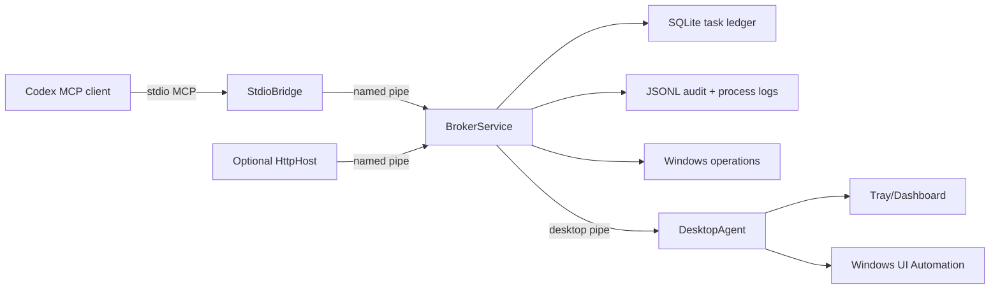

# Architecture

## Processes

- `StdioBridge` is optimized for fast Codex startup. It uses the official MCP C# SDK over stdio and forwards calls to the broker.
- `BrokerService` owns durable state, process tracking, audit logging, filesystem/process/system/registry/service/dev tools, and optional HTTP delegation.
- `DesktopAgent` runs in the interactive session for UI Automation, screenshots, clipboard, hotkeys, and tray UX.
- `HttpHost` is optional, localhost-only by default, and bearer-token protected when enabled.

## Storage

Default per-user storage is `%LOCALAPPDATA%\WindowsPowerUserMcp` with `db`, `logs`, `tasks`, `processes`, `screenshots`, `handoffs`, and `patches` subdirectories. Service-level deployments may use `%PROGRAMDATA%\WindowsPowerUserMcp`.
