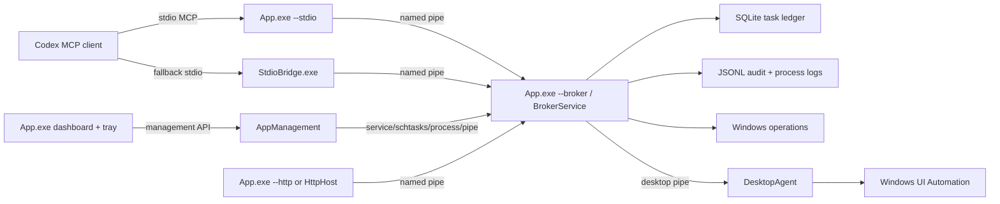

# Architecture

## Processes

- `WindowsPowerUserMcp.App`: all-in-one product shell. It hosts dashboard/tray mode, broker mode, service mode, stdio mode, HTTP mode, and release operation modes.
- `WindowsPowerUserMcp.AppManagement`: shared install/service/tray/update/diagnostics library used by UI, scripts, and tests.
- `WindowsPowerUserMcp.StdioBridge`: retained for development and fallback MCP stdio.
- `WindowsPowerUserMcp.BrokerService`: retained standalone broker for diagnostics and development.
- `WindowsPowerUserMcp.DesktopAgent`: interactive per-user UI automation process.
- `WindowsPowerUserMcp.HttpHost`: retained standalone optional HTTP host.

## Dashboard

The app dashboard is WPF. It provides Home, Backend, Desktop Agent, Codex Setup, Install & Update, Tasks, Logs, Diagnostics, Settings, and About views. Closing the window hides to tray by default; explicit exit is available from the window and tray menu.

## Storage

Default per-user storage is `%LOCALAPPDATA%\WindowsPowerUserMcp` with `db`, `logs`, `tasks`, `processes`, `screenshots`, `handoffs`, and `patches` subdirectories. Service deployments may use `%PROGRAMDATA%\WindowsPowerUserMcp`.

Install state is stored in `%LOCALAPPDATA%\WindowsPowerUserMcp\install-state.json`, with support for install-root and machine-level state reconstruction.
